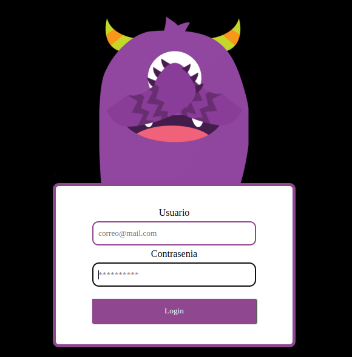

# Login Animado



```

 agregar imagen de por link
```

```
 agregar imagen por un path relativo
```

## Agregar imagen al README.md

Muchas de las soluciones publicadas son incompletas o no a mi gusto.

- Una CDN externa como imgur añade otra herramienta a la cadena. Meh.
- Crear un problema ficticio en el gestor de problemas es un truco. Crea desorden y confunde a los usuarios. Es un dolor migrar esta solución a una bifurcación, o fuera de GitHub.
- El uso de la rama gh-pages hace que las URL sean frágiles. Otra persona que trabaja en el proyecto mantener la gh-page puede no saber algo externo depende de la ruta a estas imágenes. La rama gh-pages tiene un comportamiento particular en GitHub que no es necesario para alojar imágenes CDN.
- El seguimiento de activos en el control de versiones es algo bueno. A medida que un proyecto crece y cambia, es una forma más sostenible de administrar y rastrear los cambios de varios usuarios.
- Si una imagen se aplica a una revisión específica del software, puede ser preferible vincular una imagen inmutable. De esa manera, si la imagen se actualiza más tarde para reflejar los cambios en el software, cualquier persona que lea el readme de esa revisión encontrará la imagen correcta.

Mi solución preferida, inspirada en [esta esencia ](https://gist.github.com/joncardasis/e6494afd538a400722545163eb2e1fa5), es usar una rama **assets** con **permalinks a revisiones específicas** .

```
git checkout --orphan assets
git reset --hard
cp /path/to/cat.png .
git add .
git commit -m 'Added cat picture'
git push -u origin assets
git rev-parse HEAD  # Print the SHA, which is needed below.
```

Construir un "enlace permanente" a esta revisión de la imagen, y envolverlo en Markdown:

```

```

Por ejemplo

```

```

Para mostrar siempre la última imagen en la rama assets, use `assets` en lugar del sha:

```

```